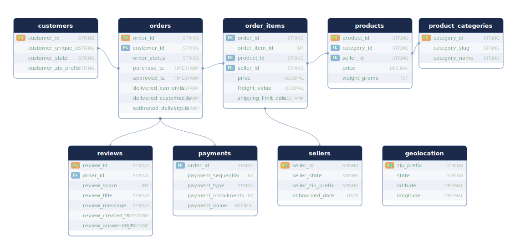
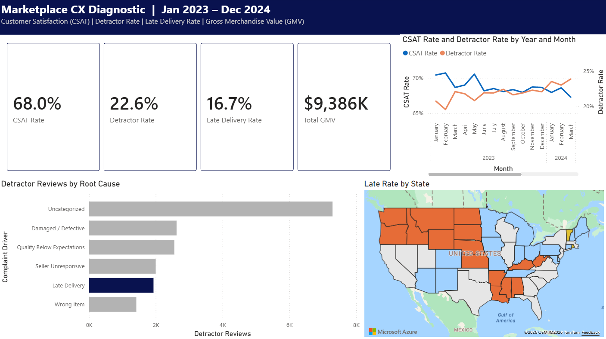
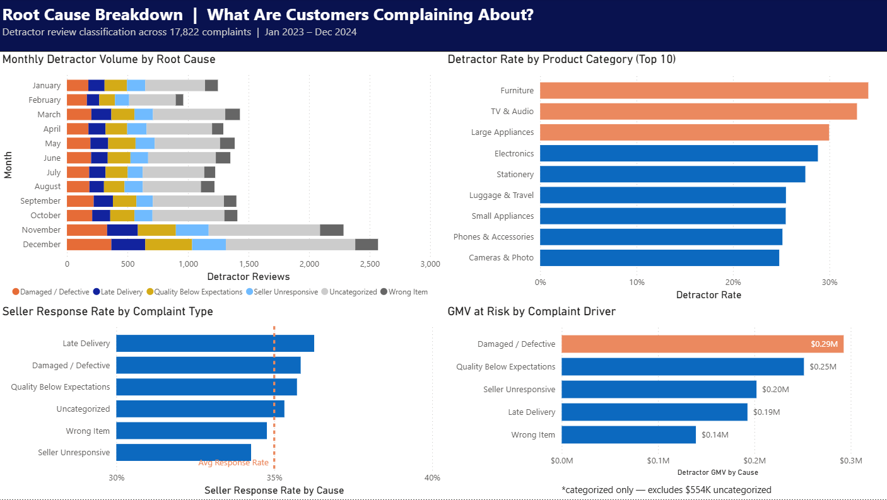
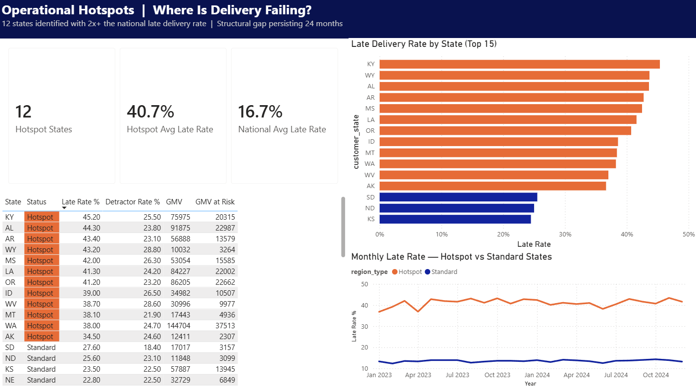
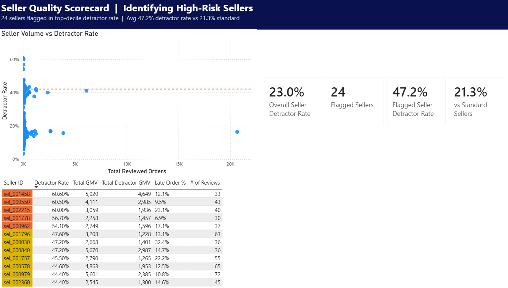

# Project Background

A US-based online marketplace has processed over 100,000 orders across a 24-month period (January 2023 through December 2024), generating $9.4M in gross merchandise value through 2,500 active sellers and 42 product categories. Customer reviews indicate a 68% satisfaction rate (CSAT), but a 22.6% detractor rate signals persistent friction across the order lifecycle. This analysis uses a marketplace transaction dataset as a structural analog to on-demand delivery platforms -- the data model (sellers, orders, delivery SLAs, reviews, payments) mirrors the operational environment at companies like DoorDash, Instacart, and Uber Eats.

This diagnostic was conducted from a CX operations analyst perspective to answer a core question: **what systemic failures are driving customer complaints, and where should the business invest to reduce them?**

Insights and recommendations are provided on the following key areas:

- **Root Cause Taxonomy:** Classifying 17,822 detractor reviews into actionable complaint categories using keyword-based text mining to identify which failures drive the most dissatisfaction.
- **Late Delivery Impact:** Quantifying the relationship between delivery performance and complaint rates, including dollar exposure by lateness severity across 12 flagged states.
- **Seller Quality:** Identifying a cohort of 24 high-risk sellers whose detractor rates are 2.2x the marketplace average and sizing their financial impact.
- **Customer Retention Risk:** Profiling repeat complainers who file multiple complaints but represent 2.4x higher lifetime value than non-complainers, and uncovering how installment payment behavior compounds complaint sensitivity.

The SQL queries used to inspect and clean the data for this analysis can be found [here](sql/01_data_quality_audit.sql).

The SQL queries used to build the master analysis view can be found [here](sql/02_cx_kpi_views.sql).

Targeted SQL queries regarding various business questions can be found here: [Root Cause](sql/03_root_cause_taxonomy.sql) | [Late Delivery](sql/04_late_delivery_impact.sql) | [Seller Cohort](sql/05_seller_cohort.sql) | [Regional Hotspots](sql/06_regional_hotspots.sql) | [Repeat Complainers](sql/07_repeat_complainers.sql) | [Installment Correlation](sql/08_installment_correlation.sql)

An interactive Power BI dashboard used to report and explore CX trends can be found [here](https://app.powerbi.com/view?r=eyJrIjoiOTg4MDQyNzctZGQwOC00ODFhLTlkZjctYTYyNGI5MTRkOTFlIiwidCI6ImJiY2FkYzkxLTRmZTktNDU4Mi1iNWJhLTRkNjgyNTQzNmJlYSJ9).

# Data Structure & Initial Checks

The marketplace database structure as seen below consists of nine tables: orders, customers, order_items, products, product_categories, sellers, payments, reviews, and geolocation, with a total row count of 530,066 records. A description of each table is as follows:

- **orders:** Central fact table with 100,000 rows. One row per order with purchase, approval, delivery, and estimated delivery timestamps plus order status.
- **customers:** One row per order (100,000 rows). Contains customer_unique_id for linking the same buyer across multiple orders.
- **order_items:** One row per item per order (129,650 rows). Contains price, freight value, seller_id, and product_id.
- **products:** Product catalog (15,000 rows). Contains category_id and weight.
- **product_categories:** Category lookup (42 rows). Maps category_id to display name.
- **sellers:** Seller directory (2,500 rows). Contains seller state and onboarded date.
- **payments:** Payment records (107,804 rows). Contains payment type, installment count, and amount.
- **reviews:** Customer review records (78,687 rows). Contains review score (1-5), free-text message, and seller response timestamp.
- **geolocation:** Zip prefix to coordinates lookup (5,000 rows).

A data quality audit was performed prior to analysis -- the full audit queries and findings can be found [here](sql/01_data_quality_audit.sql). No nulls were found on any critical analytical fields (review scores, prices, seller and product IDs). The 9.1% null rate on `delivered_customer_ts` is expected and corresponds to the 12.1% of orders that did not reach delivered status. The dataset spans **January 1, 2023 through December 31, 2024** -- 24 full months across 731 active days.

One pre-analysis observation: **88.8% of customer reviews received no seller response**, indicating a systemic service recovery gap explored further in the analysis.

# Executive Summary

### Overview of Findings

Across 78,687 reviewed orders, the marketplace carries $1.57M in GMV directly tied to detractor reviews. Damaged/defective product -- not late delivery -- is the #1 categorized complaint driver at 16.7% of detractors, concentrated in Furniture, Large Appliances, and Electronics. Meanwhile, a structural logistics gap in 12 states has persisted at 2.6x the national late rate for 24 consecutive months with zero improvement, and a small cohort of 24 problem sellers operates at double the marketplace detractor rate while going silent on customer complaints. The highest-risk retention segment -- repeat complainers -- turns out to be the highest-value: they spend 2.4x more than non-complainers but receive almost no structured follow-up.

# Insights Deep Dive

### Root Cause Taxonomy:

* **Damaged/defective product is the #1 categorized complaint at 16.7% of detractor reviews, representing $284K in GMV at risk.** This exceeds late delivery (12.4%), quality below expectations (14.3%), seller unresponsive (11.2%), and wrong item (9.4%). The remaining 35.9% of detractor reviews could not be classified by keyword patterns, signaling a need for structured complaint capture at the platform level.

* **Furniture leads damaged-product complaints at 27.2% of its detractor reviews, followed by Large Appliances (26.2%) and Electronics (21.7%).** These are heavy, high-value, shipping-sensitive categories. The concentration suggests a packaging and handling problem on fragile SKUs rather than a broad marketplace quality issue.

* **Seller response rate is flat at 34-36% regardless of complaint type.** There is no evidence of complaint triage -- sellers respond to damaged product reports at the same rate as late delivery complaints. This represents a missed service recovery opportunity across the board and indicates that sellers have no incentive or tooling to prioritize high-severity cases.

* **November and December detractor volume nearly doubles (~650/month to 1,200+) in both 2023 and 2024.** The root cause mix stays stable during holiday months -- the same problems persist, they just scale with volume. Holiday surge planning should include CX capacity, not just fulfillment capacity.

### Late Delivery & Regional Hotspots:

* **Late orders carry a 31.0% detractor rate vs 19.7% on-time -- a 1.57x lift.** The relationship is monotonic: 1-3 days late hits 29.3%, 4-7 days reaches 34.2%, and 8+ days produces a 44.0% detractor rate, more than double the on-time baseline. Total dollar exposure is $329K in detractor GMV from late orders, with $1.0M in total late GMV.

* **Late delivery rate has been flat at 15-17% for all 24 months with no improvement trend.** This is not a worsening problem, but it is not being addressed. The operational status quo is producing a steady stream of preventable complaints month after month.

* **12 states exceed 2x the national late rate, averaging 40.7% vs 15.7% nationally -- a 2.6x gap.** Kentucky (45.2%), Alabama (44.3%), Arkansas (43.4%), Mississippi (42.0%), and Louisiana (41.3%) lead the rural South cluster. Oregon (41.2%) and Washington (38.0%) anchor the Pacific Northwest cluster. These are last-mile infrastructure gaps, not seasonal or transient issues.

* **In hotspot states, late delivery accounts for 27.5% of complaint root causes vs 12.4% nationally.** This confirms that the elevated detractor rate in these regions is specifically a logistics problem, not a product quality or seller quality problem. Monthly trends show hotspot states locked at 38-43% and standard states at 12-14% for 24 months -- two parallel realities with no convergence.

### Seller Quality:

* **24 problem sellers (top decile, minimum 30 orders) average a 47.2% detractor rate vs 21.3% for standard sellers -- 2.2x worse.** 47% of problem seller GMV generates a complaint, compared to 24.2% for standard sellers. These sellers are not just underperforming -- nearly half their revenue is producing a negative customer experience.

* **Problem sellers' top complaint type is seller unresponsive at 16.6% (vs 11.2% overall).** This is a behavioral signal, not a product quality signal. These sellers go silent after the sale. A mandatory response SLA would address this directly without requiring product-level intervention.

* **Furniture and Electronics drive the highest detractor rates within the problem seller cohort.** Furniture problem sellers hit 58.5% detractor rate and Electronics reaches 57.8%. The overlap between high-risk categories and high-risk sellers compounds the damage -- the worst products are being sold by the worst sellers.

* **A single seller (sel_001072) carries 6,120 orders, $527K GMV, and a 41.1% detractor rate.** This seller sits just below the P90 flagging threshold but represents the largest single point of CX risk in the marketplace. A watch-list mechanism for high-volume sellers approaching the threshold would catch cases like this before they accumulate damage.

### Customer Retention & Payment Behavior:

* **7.8% of customers filed 2+ complaints, but they represent 16.6% of total GMV ($1.07M).** Repeat complainers spend 2.4x more than zero-complaint customers ($315 avg lifetime GMV vs $134). Customers with 3+ complaints average $464. The people complaining the most are the most valuable customers.

* **50.4% of customers who filed a complaint placed another order afterward, returning on average 177 days later.** Combined with the 88.8% unanswered review rate, this is a significant missed service recovery opportunity. Half of complainers are giving the marketplace a second chance with no structured follow-up.

* **Root cause mix is nearly identical across complaint #1, #2, and #3.** Damaged/defective runs 16-19%, quality runs 14-18%, late delivery runs 11-13% at every complaint sequence. Repeat complainers are not encountering the same seller or product twice -- they are hitting the same systemic failures repeatedly because nothing upstream is getting fixed.

* **6+ installment orders carry a 30.2% detractor rate vs 22.1% for single-payment -- a 1.37x lift.** When combined with late delivery, 6+ installment orders reach a 38.0% detractor rate -- the highest combination in the dataset and a 2x gap over single-payment on-time. These customers are financing $120 avg purchases and still paying for something that disappointed them. Payment terms are a reliable proxy for purchase sensitivity.

# Recommendations

Based on the insights and findings above, the following recommendations are provided:

* Late orders produce a 1.57x detractor lift, with 8+ day delays reaching 44% detractor rate and $329K in detractor GMV exposure. **Implement proactive delivery-delay alerts for orders exceeding SLA by 2+ days, with automated compensation offers for 4+ day delays. Target: reduce late-order detractor rate from 31% to 24%.** Owner: Logistics Ops.

* 24 problem sellers average 47.2% detractor rate (2.2x baseline) with seller-unresponsive complaints at 16.6% of their complaint mix. **Launch a seller quality program with mandatory response SLAs and probation thresholds for sellers exceeding 40% detractor rate. Target: reduce problem seller detractor rate to below 35% within 6 months.** Owner: Seller Quality.

* 12 states show 40.7% avg late rate (2.6x national) with zero improvement over 24 months -- $186K in detractor GMV. **Prioritize last-mile carrier partnerships in KY, AL, AR, MS, LA, OR, WA, and ID. Negotiate regional SLAs or add alternative carrier options. Target: reduce hotspot late rate from 40.7% to 25% within 12 months.** Owner: Logistics Ops.

* Repeat complainers represent 16.6% of GMV ($1.07M) despite being 7.8% of customers, and 50.4% return after complaining with no structured outreach. **Build a repeat-complainer intervention workflow: any customer with 2+ detractor reviews in 12 months triggers proactive outreach and a recovery offer. Target: reduce repeat complaint rate by 20% and increase return rate from 50% to 65%.** Owner: CX / Retention.

* Furniture (27.2%), Large Appliances (26.2%), and Electronics (21.7%) lead damaged/defective complaint share -- the top three categories by weight and shipping sensitivity. **Require enhanced packaging standards for these three categories, including reinforced packaging, fragile labeling, and carrier handling instructions. Target: reduce damaged/defective complaint share from 16.7% to 12%.** Owner: Product / Supply Chain.

* 6+ installment orders combined with late delivery produce a 38.0% detractor rate (2x baseline), with $160K in detractor GMV. **Flag 6+ installment orders for priority fulfillment routing and proactive tracking notifications. Target: reduce 6+ installment detractor rate from 30.2% to 24%.** Owner: Product / Finance.

# Assumptions and Caveats

Throughout the analysis, multiple assumptions were made to manage challenges with the data. These assumptions and caveats are noted below:

* This analysis uses a synthetically generated dataset modeled on real marketplace data structures. The Olist Brazilian E-Commerce dataset served as the structural inspiration for the schema design. All findings reflect patterns engineered into the data to demonstrate analytical methodology.

* Root cause categories were assigned using keyword pattern matching (SQL LIKE statements), not ML-based NLP. The 35.9% uncategorized rate reflects the inherent limitation of keyword-based approaches. A production implementation would use a fine-tuned text classifier to reduce the uncategorized share.

* Reviews are the only customer voice signal available. There is no ticket system, chat log, or phone interaction data. A real-world diagnostic would incorporate support contact history to capture complaints that never reach the review stage.

* No explicit refund or chargeback table exists in the dataset. Refund exposure is inferred from order status (canceled/returned) and detractor review association. Actual refund dollar amounts are not available.

* For multi-item orders, root cause analysis uses the first item's product category and seller. This may misattribute complaints on orders containing items from different sellers or categories.

* The review_answered_ts field captures whether a seller responded but not the quality or resolution outcome of that response. The 35% response rate does not indicate a 35% resolution rate.

* State-level geography is used as a proxy for last-mile logistics quality. Actual delivery performance is driven by carrier routing, warehouse proximity, and local infrastructure -- none of which are modeled in the dataset.