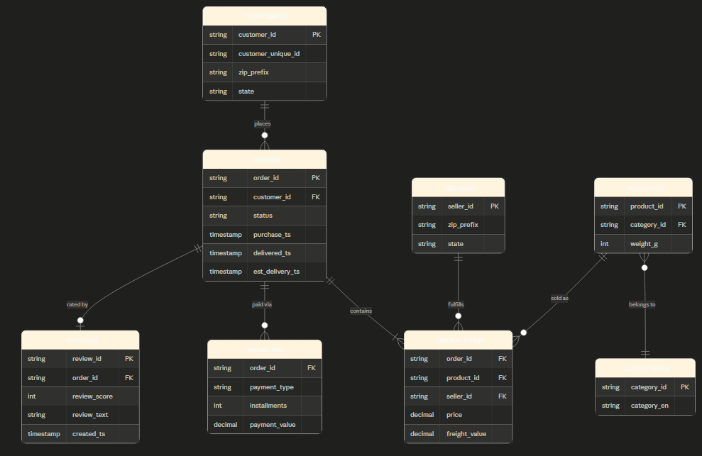

## Project Background

This section should clearly describe the background of the company as well as the goalsXX

Insights and recommendations are provided on the following key areas: (examples)
- **Sales and Trend Analysis**: Description and focusXX
- **Loyalty Program Success**: XX
- **Regional Comparisons**: XX

An interactive Power BI dashboard can be viewed here.

The SQL queries utilized to inspect and perform quality checks can be found here.XX

The SQL queries utilized to clean, organize, and prepare data for the dashboard can be found here.XX

Targeted SQL Queries regarding various business questions can be found here.XX

## Data Structure & Initial Checks
The database consists of 9 tables with a total of **530,066 records** across all entities.The central fact table is `orders` (100,000 rows), which connects to `customers`, `order_items`, `products`, `sellers`, `payments`, and `reviews`  via foreign keys. All referential integrity checks returned zero orphaned records.

A data quality audit was performed prior to analysis, the full audit queries and findings can be found [here](sql/01_data_quality_audit.sql).

No nulls were found on any critical analytical fields. The 9.1% null rate on `delivered_customer_ts` is expected and corresponds to the 12.1% of orders that did not reach delivered status. The dataset spans **January 1, 2023 through December 31, 2024** (24 full months of transaction history).

One pre-analysis observation: **88.8% of customer reviews received no seller response**, indicating a systemic service recovery gap explored further in the analysis.

## Executive Summary

3-4 sentence of overview of findings (get to the point) XX
USE NUMBERS AND SCALE HERE

screenshot of power bi dashboard

ok now go 1 degree of detail further 

##### Subfindings 1
- quantified value
- business metric
- simple story about historical trends
- structured image of graph/chart

##### Subfindings 2
- quantified value
- business metric
- simple story about historical trends
- structured image of graph/chart

### Recommendations:

Based on discovered insights, the following recommendations have been provided:
- a
- 2

GENERAL RULES
1. use clean and aesthetic formatting
2. speak in common industry terms
3. include a caveats and assumptions section